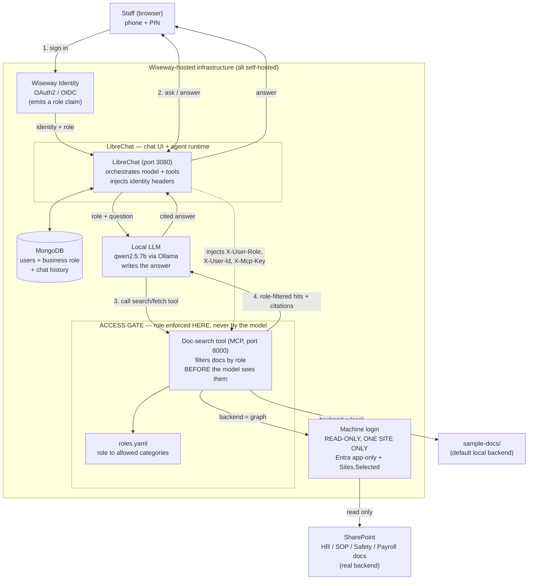
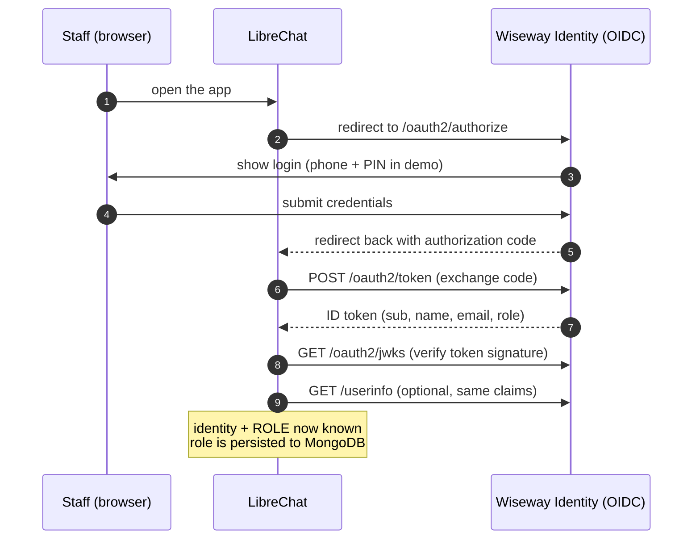
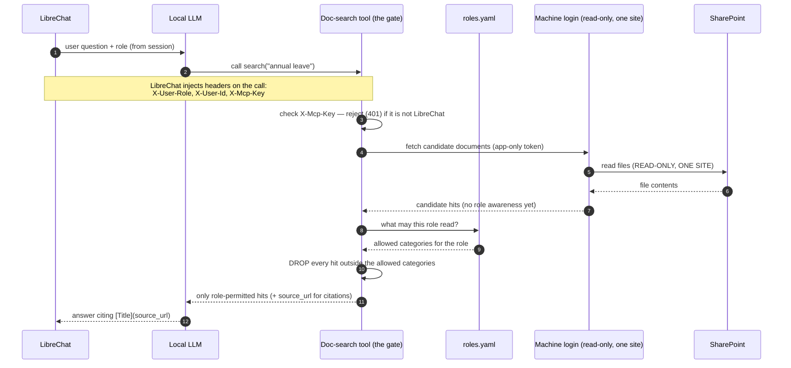

# agent-wise — Architecture

Wiseway-branded AI assistant for blue-collar staff. Staff log in with their
phone + PIN, ask plain-English HR / SOP / safety questions, and get answers that
are **cited** back to the source document and **scoped to their role** — a
warehouse worker can never be shown a payroll document, and the model never even
sees one.

This document describes how the pieces fit together. It is the map for the
handover; the integration guide (`docs/INTEGRATION.md`) covers the work to wire
it into Wiseway's real systems, and `README.md` covers running it locally.

---

## 1. Executive summary (read this first)

The assistant is a chat app for staff. When someone asks a question, three things
happen, in order:

1. **They prove who they are.** Staff sign in through Wiseway's normal login
   (in the demo, a stand-in phone + PIN screen). The login tells the app two
   things: *who* the person is, and *what role* they have — warehouse, driver,
   office, or HR admin.

2. **A search tool finds the relevant documents — and filters them by role.**
   The assistant cannot read documents on its own. It must ask a separate
   **document-search tool**, and that tool is the gatekeeper: it looks up what
   the person's role is allowed to see and **throws away everything else before
   the answer is written**. The filtering happens in the tool, not in the AI, so
   it cannot be talked around or prompted away.

3. **The AI answers, with sources.** The model writes a plain-English answer
   using only the documents it was handed, and links each fact back to the
   policy it came from.

Two design choices make this safe and cheap to run:

- **One read-only "machine login" for documents.** Staff do not have SharePoint
  accounts. Instead, a single service identity — locked to **read-only** access
  on **one** SharePoint site — fetches documents on everyone's behalf. The
  per-person security is then applied by the search tool's role filter, not by
  SharePoint.

- **Everything is self-hosted.** The chat app, the database, the search tool,
  and the AI model all run on Wiseway-controlled infrastructure. Nothing about a
  staff question is required to leave Wiseway's environment.

The rest of this document is for the technical team.

---

## 2. Components at a glance

Four services run as containers (defined in `docker-compose.yml`); the LLM runs
natively on the host. In the demo, the identity provider and the document source
are local stand-ins — both are designed to be swapped for Wiseway's real systems
without touching the security logic.

| Box in the diagrams | Folder / file | What it is | Demo vs. production |
|---|---|---|---|
| **Staff (browser)** | — | Blue-collar staff on a phone or shared terminal | unchanged |
| **Wiseway Identity (OAuth2/OIDC)** | `mock-idp/` | Issues identity + a `role` claim after login | Demo = mock phone+PIN IdP; **replace with Wiseway SSO** |
| **LibreChat (chat UI + API)** | `deploy/librechat.yaml`, `deploy/.env.example` | The chat front end and agent runtime; orchestrates the model + tools; injects identity into tool calls | self-hosted, kept as-is |
| **MongoDB** | `mongodb` service in `docker-compose.yml` | LibreChat's datastore: users, the business `role`, chat history | self-hosted, kept as-is |
| **Local LLM** | `endpoints.custom` in `deploy/librechat.yaml` | The model that writes the answer (`qwen2.5:7b` via Ollama) | Demo = Ollama on host; **choose a hosted/AU-region model for production** |
| **Doc-search tool (the access gate)** | `mcp-doc-search/` | Role-scoped MCP tool: searches docs, then **filters by role before returning** | self-hosted, kept as-is |
| **Doc backend** | `mcp-doc-search/backends/` | `local` = BM25 over `sample-docs/`; `graph` = real SharePoint | Demo = `local`; **flip to `graph`** |
| **Machine login → SharePoint** | `mcp-doc-search/backends/graph.js`, `ENTRA-APP-SETUP.md` | One read-only, one-site service identity (Entra app + Graph `Sites.Selected`) | only used when backend = `graph` |
| **Sample docs** | `sample-docs/` | 6 HR/SOP/safety/payroll Markdown docs for the local backend | demo data only |

---

## 3. Component diagram (the whole system)

The doc-search tool is the **access gate** and the machine login is **read-only,
one site only** — those two facts are the spine of this design and are called out
in the diagram.

**Reading the diagram**

- Identity flows **into** the tool call as HTTP headers
  (`X-User-Role`, `X-User-Id`, `X-Mcp-Key`) — it is **never** a model-chosen
  argument. The model cannot set or change the role.
- The **access gate** subgraph is the only place documents are filtered. Swap the
  IdP, the LLM, or the doc backend and the gate is untouched.
- The **machine login** path is used only when the backend is `graph`. It is the
  single arrow that reaches SharePoint, and it is read-only on one site.

---

## 4. Login flow (OAuth2 / OIDC)

Staff authenticate against Wiseway Identity. The login's job is to return both an
**identity** and a **role** to LibreChat. In the demo this is the mock
phone + PIN provider (`mock-idp/`); in production it is Wiseway SSO — the
endpoints and claim handling are the same standard OIDC shapes.

**What the token carries.** The demo IdP emits `sub`, `name`, `email`,
`preferred_username` (the mobile number), and **`role`** (one of `warehouse`,
`driver`, `office`, `hr-admin`). LibreChat reads `name` / `email` /
`preferred_username` straight from the ID token (see `OPENID_*_CLAIM` in
`deploy/.env.example`).

**The role nuance (integration team must know this).** LibreChat lands *every*
OIDC user as its own platform role `USER`. The **business** role that drives
document access is a separate `role` string on the user's MongoDB document. In
the demo, `deploy/seed-roles.sh` writes that string per user (keyed by email);
LibreChat then substitutes it into the `X-User-Role` header via the
`{{LIBRECHAT_USER_ROLE}}` template. Because `role` *also* governs LibreChat's own
feature permissions, the business roles must exist as entries in LibreChat's
Mongo `roles` collection. `docs/INTEGRATION.md §1` covers how to make the role
arrive automatically from Wiseway SSO instead of via the seed script.

---

## 5. Document-access flow (the machine login + role gate)

This is the heart of the system. One **read-only service identity** reads
SharePoint on the staff member's behalf; the **tool filters by role before the
model sees anything**. Staff have no SharePoint accounts of their own.

**Why the machine login works this way — and what it costs.** Because the app
reads SharePoint as *itself* (app-only), not as the signed-in person, SharePoint
cannot trim results per user. That is **exactly why role enforcement lives in the
tool**. The trade-off: a cited `source_url` is the real SharePoint `webUrl`, which
will **not** open for a login-less staff member. A small read-only doc-proxy (the
app streams the file using the same machine login) is the recommended fix — see
`docs/INTEGRATION.md §6`.

**Failure modes are closed, by design:**

- **Wrong / missing `X-Mcp-Key`** → `401`, so only LibreChat (which holds
  `WISEWAY_MCP_SHARED_SECRET`) can call the tool at all.
- **Unknown or empty role** → empty allowed-category set → the user can read
  **nothing** (`allowedCategoriesFor` in `mcp-doc-search/server.js` fails closed).
- **`fetch` of a disallowed doc** → returns the same "nothing available" response
  as a non-existent doc, so the tool never leaks that a restricted doc exists.

---

## 6. The role gate in detail

The map of role → allowed document categories lives in
`mcp-doc-search/roles.yaml`. Documents carry a `category` (HR, SOP, safety,
payroll). The tool keeps only hits whose category is allowed for the caller's
role.

| Role | Allowed categories |
|---|---|
| `warehouse` | hr, sop, safety |
| `driver` | hr, sop, safety |
| `office` | hr, sop |
| `hr-admin` | hr, sop, safety, **payroll** |

Where a document's category comes from depends on the backend:

- **`local`** (`backends/local-folder.js`): the `category` field in each
  Markdown file's YAML front-matter (e.g. `category: hr` in
  `sample-docs/annual-leave-policy.md`). BM25 ranking via MiniSearch over title +
  body.
- **`graph`** (`backends/graph.js`): **derived from the SharePoint parent folder
  name** (a folder containing `payroll` → `payroll`, `safety`/`whs` → `safety`,
  `sop`/`procedure` → `sop`, otherwise `hr`). This is why production SharePoint
  should be **structured into per-category subfolders** so the folder-derived
  category gives real separation — see `docs/INTEGRATION.md §5`.

Crucially, **neither backend filters by role.** Both return an unfiltered hit
list, and the single role filter in `mcp-doc-search/server.js` runs on whatever
the backend returned. Swapping `local` ↔ `graph` therefore cannot weaken the
gate.

---

## 7. The two document backends

Selected by the `WISEWAY_DOC_BACKEND` environment variable
(`mcp-doc-search/backend.js`):

| | `local` (default) | `graph` (production) |
|---|---|---|
| Source | `sample-docs/*.md` | A real SharePoint document library |
| Credentials | none | Entra app (client id + secret), `Sites.Selected` read on one site |
| Ranking | BM25 (MiniSearch) over title + body | List + extract `.docx` text (mammoth) and rank locally |
| `category` from | YAML front-matter | parent folder name |
| `source_url` | front-matter URL | the SharePoint `webUrl` |
| Why this shape | zero-setup demo | see note below |

**Why `graph` lists-and-extracts instead of calling Graph search.** The
per-drive Graph `/root/search(q=)` endpoint returns `500 generalException` under
app-only `Sites.Selected` on a freshly provisioned site. So the backend instead
**lists** files under `SHAREPOINT_ROOT_FOLDER`, **downloads** them, **extracts**
text (`.docx` via mammoth; `.txt`/`.md`/`.csv` as plain text), caches the result
(TTL ~5 min), and ranks locally. The full Entra registration and per-site grant
are in `ENTRA-APP-SETUP.md`.

---

## 8. The doc-search tool as an MCP server

`mcp-doc-search/server.js` exposes two MCP tools — `search` and `fetch` — over a
**stateless Streamable HTTP** endpoint at `POST /mcp` (plus an unauthenticated
`GET /health`). LibreChat connects to it as the `wiseway-docs` MCP server
(`mcpServers` in `deploy/librechat.yaml`).

Trust model, enforced in `server.js`:

- **Caller authentication.** Every `/mcp` request must present
  `X-Mcp-Key == WISEWAY_MCP_SHARED_SECRET`, else `401`. This proves the request
  came from LibreChat.
- **Identity from headers only.** Role and user-id come from `X-User-Role` /
  `X-User-Id` — injected by LibreChat from the verified session — and are **never**
  part of a tool's input schema. The model cannot supply or alter them.
- **Per-request isolation.** The server runs stateless and builds a fresh
  `McpServer` per POST, capturing this request's role/user-id in the tool
  closures, so role can never leak across concurrent callers via a shared global.

Every call is written to a structured JSON audit line — `tool`, `role`,
`user_id`, `query`, the backend, and the `returned_doc_ids` actually surfaced —
which is the basis for the SIEM/audit work in `docs/INTEGRATION.md §7`.

---

## 9. The assistant agent + branding

- The **"Wiseway HR & SOP Assistant"** agent is created **once** in LibreChat's
  Agent Builder UI — it cannot be declared in YAML. It is wired to the Ollama
  endpoint + the `search`/`fetch` MCP tools, and given a system prompt that
  forces it to call `search` first and cite every fact as a Markdown
  `[Title](source_url)` link (the local model will not auto-cite without this).
  The resulting `agent_id` is pinned as the default via `modelSpecs` in
  `deploy/librechat.yaml`.
- **Branding** comes from `deploy/wiseway-assets/` (logo + favicons mounted over
  LibreChat's `/app/client/dist/assets`), the interface `customWelcome` /
  `customFooter` in `deploy/librechat.yaml`, and `APP_TITLE` in the env. The
  in-chat icon comes from `modelSpecs.iconURL` and **must be a PNG** (an SVG
  wrapping a raster fails to render); the agent's message avatar is uploaded once
  in the Agent Builder UI.

---

## 10. What is demo-only vs. production-bound

| Concern | Demo (in this repo) | Production (integration team) |
|---|---|---|
| Login | Mock phone + PIN IdP (`mock-idp/`), throwaway demo signing key & self-signed cert | Wiseway SSO (OAuth2/OIDC) emitting a `role` claim |
| Documents | `sample-docs/` via `local` backend | Real SharePoint via `graph` backend + machine login |
| LLM | Ollama `qwen2.5:7b` on the host | Self-hosted or AU-region cloud model (data-residency) |
| Role assignment | `deploy/seed-roles.sh` writes role into Mongo | Role flows from SSO / HR system |
| Secrets | Placeholder values in `deploy/.env.example` | Vault; rotate the Graph client secret (~180-day expiry) |
| Citations | Local URLs that open fine | SharePoint `webUrl` won't open for login-less staff → doc-proxy |
| Hosting | `docker-compose.yml` on one laptop | Wiseway orchestrator (k8s, TLS/ingress, scaling) |

The mock IdP and the self-signed certs are **not secure** and are throwaway by
design. A security review / pen-test of the integrated system is a go-live
prerequisite — see `docs/INTEGRATION.md §9`.

---

## 11. Where to go next

- **Running it locally:** `README.md`
- **Wiring it into Wiseway's systems (the handover guide):** `docs/INTEGRATION.md`
- **Registering the SharePoint machine identity:** `ENTRA-APP-SETUP.md`
